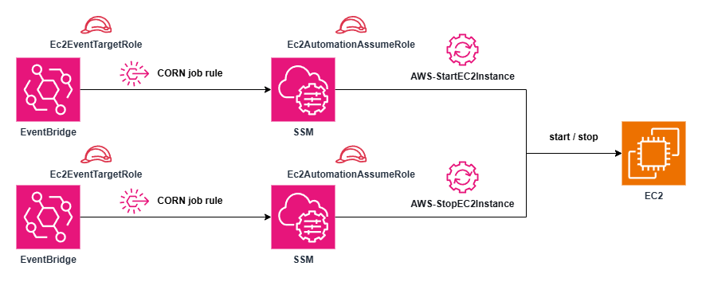

# terraform-aws-eventbridge-ec2-classic-scheduler

This module automates the scheduled **start** and **stop** of a specified EC2 instance to optimise costs and improve operational efficiency.

## Architecure

## Variables

| Name                      | Description                                 | Type          | Required |
|---------------------------|---------------------------------------------|---------------|----------|
| `scheduler_name`          | A name suffix for EventBridge rule naming   | `string`      | ✓        |
| `ec2_id`                  | The ID of the EC2 instance to control       | `string`      | ✓        |
| `ec2_region`              | The AWS region of the EC2 instance          | `string`      | ✓        |
| `schedule_ec2_start_time` | Cron expression for starting the instance   | `string`      | ✓        |
| `schedule_ec2_stop_time`  | Cron expression for stopping the instance   | `string`      | ✓        |
| `tags`                    | Tags to apply to all resources              | `map(string)` | ✕        |

## Outputs

| Name                        | Description                                                               |
|-----------------------------|---------------------------------------------------------------------------|
| `start_rule_name`           | The name of the EventBridge rule used to start the EC2 instance           |
| `stop_rule_name`            | The name of the EventBridge rule used to stop the EC2 instance            |
| `event_target_role_arn`     | The ARN of the IAM role used by EventBridge to trigger SSM automation     |
| `automation_assume_role_arn`| The ARN of the IAM role assumed by SSM to start/stop EC2 instances        |
