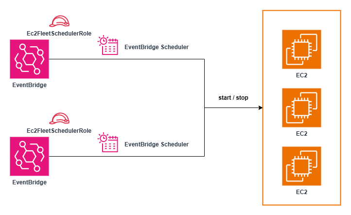

# terraform-aws-eventbridge-ec2-fleet-scheduler

This module automates the scheduled **start** and **stop** of one or more EC2 instances using **Amazon EventBridge Scheduler**. It is designed to optimise cost and streamline operational efficiency by powering EC2 instances on and off based on defined cron expressions.

## Requirements

- Terraform >= 1.12.2  
- AWS provider >= 6.0

## Architecture



## Variables

| Name                             | Description                                             | Type           | Required |
|----------------------------------|---------------------------------------------------------|----------------|----------|
| `scheduler_name`                 | A name suffix used for schedule naming                 | `string`       | ✓        |
| `ec2_ids`                        | A list of EC2 instance IDs to control                  | `list(string)` | ✓        |
| `schedule_ec2_fleet_start_time` | Cron expression for starting the EC2 instances         | `string`       | ✓        |
| `schedule_ec2_fleet_stop_time`  | Cron expression for stopping the EC2 instances         | `string`       | ✓        |
| `tags`                           | Tags to apply to all resources                         | `map(string)`  | ✕        |

> ℹ️ The region and account ID are automatically detected using data sources: `aws_region.current` and `aws_caller_identity.current`.

## Outputs

| Name                           | Description                                                                 |
|--------------------------------|-----------------------------------------------------------------------------|
| `start_schedule_name`          | The name of the EventBridge Scheduler schedule used to start the EC2s      |
| `stop_schedule_name`           | The name of the EventBridge Scheduler schedule used to stop the EC2s       |
| `ec2_scheduler_role_arn`       | The ARN of the IAM role used by EventBridge Scheduler                      |
| `ec2_scheduler_role_policy_id` | The ID of the IAM policy attached to the scheduler role                    |

## Example

```hcl
resource "aws_instance" "example" {
  count         = 2
  ami           = "ami-abcdefghi1234567890"
  instance_type = "t2.micro"

  tags = {
    Name = "example-ec2-${count.index + 1}"
  }
}

module "ec2_scheduler" {
  source  = "path/to/this/module"

  scheduler_name                 = "my-ec2-schedule"
  ec2_ids                        = [for i in aws_instance.example : i.id]
  schedule_ec2_fleet_start_time = "cron(0 21 * * ? *)"  # UTC time
  schedule_ec2_fleet_stop_time  = "cron(0 12 * * ? *)"  # UTC time
  tags = {
    Environment = "Dev"
  }
}