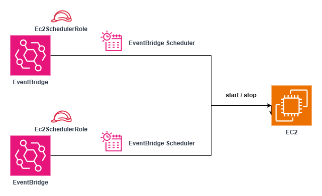

# terraform-aws-eventbridge-ec2-scheduler

This module automates the scheduled **start** and **stop** of a specified EC2 instance using **Amazon EventBridge Scheduler**. It is designed to optimise cost and streamline operational efficiency by powering EC2 on and off based on defined cron expressions.

## Requirements

- Terraform >= 1.12.2
- AWS provider >= 6.0

## Architecture



## Variables

| Name                      | Description                                 | Type          | Required |
|---------------------------|---------------------------------------------|---------------|----------|
| `scheduler_name`          | A name suffix used for schedule naming      | `string`      | ✓        |
| `ec2_id`                  | The ID of the EC2 instance to control       | `string`      | ✓        |
| `schedule_ec2_start_time` | Cron expression for starting the instance   | `string`      | ✓        |
| `schedule_ec2_stop_time`  | Cron expression for stopping the instance   | `string`      | ✓        |
| `tags`                    | Tags to apply to all resources              | `map(string)` | ✕        |

> ℹ️ The region and account ID are automatically detected using data sources: `aws_region.current` and `aws_caller_identity.current`.

## Outputs

| Name                          | Description                                                                 |
|-------------------------------|-----------------------------------------------------------------------------|
| `start_schedule_name`         | The name of the EventBridge Scheduler schedule used to start the EC2       |
| `stop_schedule_name`          | The name of the EventBridge Scheduler schedule used to stop the EC2        |
| `ec2_scheduler_role_arn`      | The ARN of the IAM role used by EventBridge Scheduler                      |
| `ec2_scheduler_role_policy_id`| The ID of the IAM policy attached to the scheduler role                    |

## Example

```hcl
module "ec2_scheduler" {
  source  = "path/to/this/module"
  scheduler_name = "my-ec2-schedule"
  ec2_id          = "i-0123456789abcdef0"
  schedule_ec2_start_time = "cron(0 21 * * ? *)"  # UTC time
  schedule_ec2_stop_time  = "cron(0 12 * * ? *)"  # UTC time
  tags = {
    Environment = "Dev"
  }
}