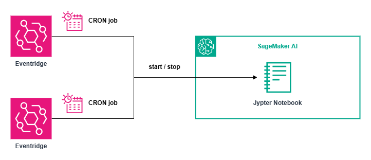

# terraform-aws-eventbridge-sagemaker-ai-scheduler

This module automates the scheduled **start** and **stop** of a specified SageMaker AI notebook instance using **Amazon EventBridge Scheduler**. It is ideal for optimising cost and ensuring notebooks are only running during defined operational hours.

## Requirements

- Terraform >= 1.12.2  
- AWS provider >= 6.0

## Architecture



## Variables

| Name                          | Description                                             | Type          | Required |
|-------------------------------|---------------------------------------------------------|---------------|----------|
| `scheduler_name`              | The name of the scheduler                               | `string`      | ✓        |
| `notebook_id`                 | The name of the SageMaker AI notebook instance          | `string`      | ✓        |
| `schedule_notebook_start_time`| Cron expression for starting the notebook instance      | `string`      | ✓        |
| `schedule_notebook_stop_time` | Cron expression for stopping the notebook instance      | `string`      | ✓        |
| `tags`                        | Tags to apply to all resources                          | `map(string)` | ✕        |

> ℹ️ The region and account ID are automatically detected using data sources: `aws_region.current` and `aws_caller_identity.current`.

## Outputs

| Name                           | Description                                                                   |
|--------------------------------|-------------------------------------------------------------------------------|
| `start_schedule_name`          | The name of the EventBridge Scheduler schedule used to start the notebook    |
| `stop_schedule_name`           | The name of the EventBridge Scheduler schedule used to stop the notebook     |
| `sagemaker_ai_scheduler_role_arn` | The ARN of the IAM role used by EventBridge Scheduler                      |
| `notebook_instance_arn`        | The full ARN of the SageMaker notebook instance                              |

## Example

```hcl
module "notebook_scheduler" {
  source = "path/to/this/module"

  scheduler_name                 = "example"
  notebook_id                    = "multi-agent-app"
  schedule_notebook_start_time   = "cron(0 0 * * ? *)" # UTC time
  schedule_notebook_stop_time    = "cron(0 12 * * ? *)" # UTC time

  tags = {
    Environment = "test"
  }
}
