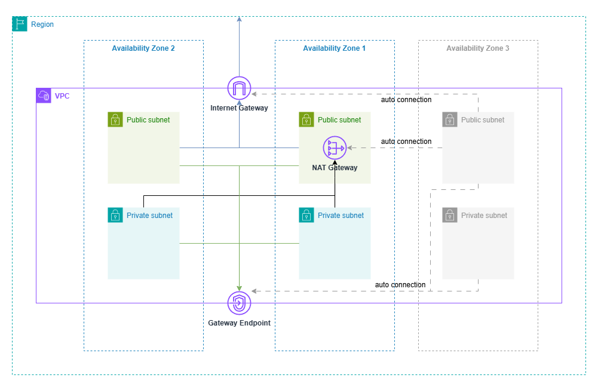

# terraform-aws-vpc-gereral-core

This module provisions a **basic VPC infrastructure** with public and private subnets, NAT Gateway, Internet Gateway, and S3 VPC Endpoint. It is designed for general-purpose AWS network topologies, supports tagging and DNS configuration, and ensures that newly launched resources are automatically connected to the appropriate route tables and networking components.

## Requirements

- Terraform >= 1.12.2  
- AWS provider >= 6.0

## Architecture



## Variables

| Name                     | Description                                              | Type           | Required |
|--------------------------|----------------------------------------------------------|----------------|----------|
| `vpc_identifier`         | A name identifier used as a prefix for resources         | `string`       | ✓        |
| `vpc_cidr`               | The CIDR block for the VPC                               | `string`       | ✓        |
| `vpc_public_subnets_cidr`  | List of CIDRs for public subnets                        | `list(string)` | ✓        |
| `vpc_private_subnets_cidr` | List of CIDRs for private subnets                       | `list(string)` | ✓        |
| `enable_dns_hostnames`  | Whether to enable DNS hostnames                          | `bool`         | ✕ (default: `true`) |
| `enable_dns_support`    | Whether to enable DNS resolution support                 | `bool`         | ✕ (default: `true`) |
| `tags`                  | A map of tags to apply to all resources                  | `map(string)`  | ✕        |

> ℹ️ The current AWS region and availability zones are automatically detected using data sources: `aws_region.current` and `aws_availability_zones.available`.

## Outputs

| Name                  | Description                                   |
|-----------------------|-----------------------------------------------|
| `vpc_id`              | The ID of the created VPC                     |
| `public_subnet_ids`   | List of public subnet IDs                    |
| `private_subnet_ids`  | List of private subnet IDs                   |
| `nat_gateway_id`      | The NAT Gateway ID                            |
| `internet_gateway_id` | The Internet Gateway ID                       |
| `s3_vpc_endpoint_id`  | The ID of the S3 Gateway VPC Endpoint         |
| `vpc_cidr_block`      | The CIDR block used by the VPC                |

## Example

```hcl
module "vpc" {
  source = "path/to/this/module"

  vpc_identifier           = "my-vpc"
  vpc_cidr                 = "10.0.0.0/16"
  vpc_public_subnets_cidr  = ["10.0.1.0/24", "10.0.2.0/24"]
  vpc_private_subnets_cidr = ["10.0.10.0/24", "10.0.11.0/24"]

  tags = {
    Environment = "dev"
  }
}